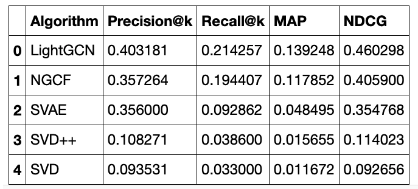

Better Than Netflix Movie Recommender
==============================

# Synopsis

Movie recommendation is core to Netflix, where their goal is to keep users
engaged and on their service for longer. More than 10 years after The Netflix
Prize competition, we explore advances in recommendation systems comparing
their performance to the winning algorithm from 2009. Taking advantage of
graphs, we implement from scratch a state-of-the-art recommender, Light Graph
Convolution Network (LightGCN) that vastly outperforms many traditional as well
as newer recommenders.

# Outcome
LightGCN vastly outperforms all other models. When compared to SVD++, LightGCN
achieves an increase in Percision@k by 29%, Recall@k by 18%, MAP by 12%, and
NDCG by 35%, demonstrating how far recommendation systems have advanced
since 2009.

(ranking metrics: the higher the better)

Project Organization
------------

    ├── LICENSE
    ├── Makefile           <- Makefile with commands like `make data` or `make train`
    ├── README.md          <- The top-level README for developers using this project.
    ├── data               <- Data used for modeling
    │
    ├── models             <- Trained and serialized models, model predictions, or model summaries
    │
    ├── notebooks          <- Jupyter notebooks ordered by number. Contains the EDA,
    │                         implementation of the models, and comparsion of all the models
    │
    ├── reports            <- Generated analysis as HTML, PDF, LaTeX, etc.
    │   └── figures        <- Generated graphics and figures to be used in reporting
    │
    ├── requirements.txt   <- The requirements file for reproducing the analysis environment, e.g.
    │                         generated with `pip freeze > requirements.txt`
    │
    ├── setup.py           <- makes project pip installable (pip install -e .) so src can be imported
    ├── src                <- Source code for use in this project.
    │   ├── __init__.py    <- Makes src a Python module
    │   │
    │   ├── data           <- Scripts to download or generate data
    │   │   └── make_dataset.py
    │   │
    │   ├── features       <- Scripts to turn raw data into features for modeling
    │   │   └── build_features.py
    │   │
    │   ├── models         <- Scripts to train models and then use trained models to make
    │   │   │                 predictions
    │   │   ├── predict_model.py
    │   │   └── train_model.py
    │   │
    │   └── visualization  <- Scripts to create exploratory and results oriented visualizations
    │       └── visualize.py
    │
    └── tox.ini            <- tox file with settings for running tox; see tox.readthedocs.io

--------

<small>Project based on the <a target="_blank" href="https://drivendata.github.io/cookiecutter-data-science/">cookiecutter data science project template</a>. #cookiecutterdatascience</small>

